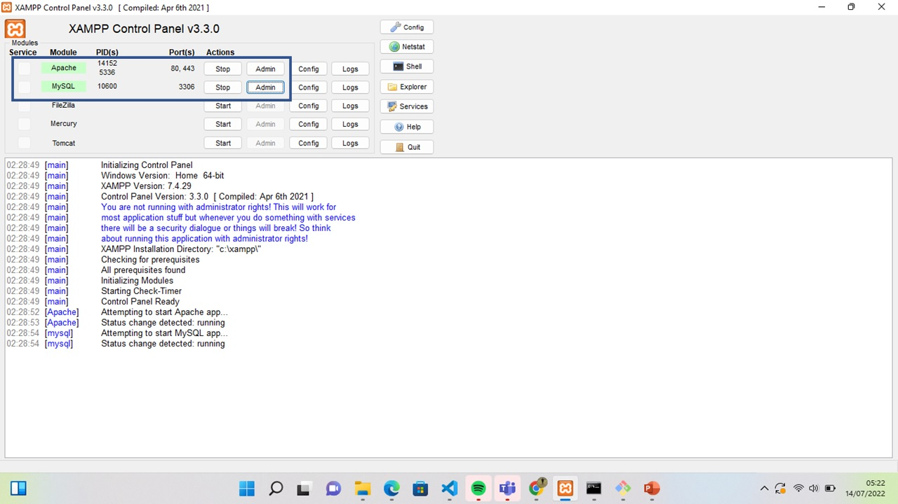
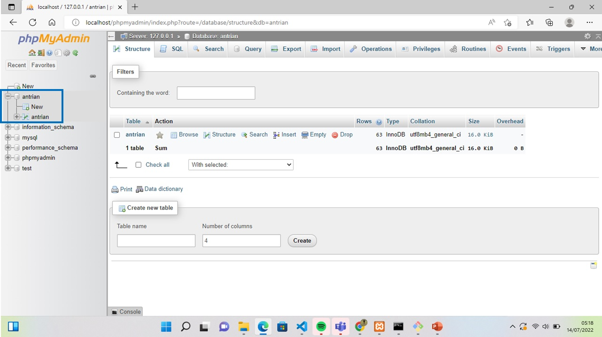
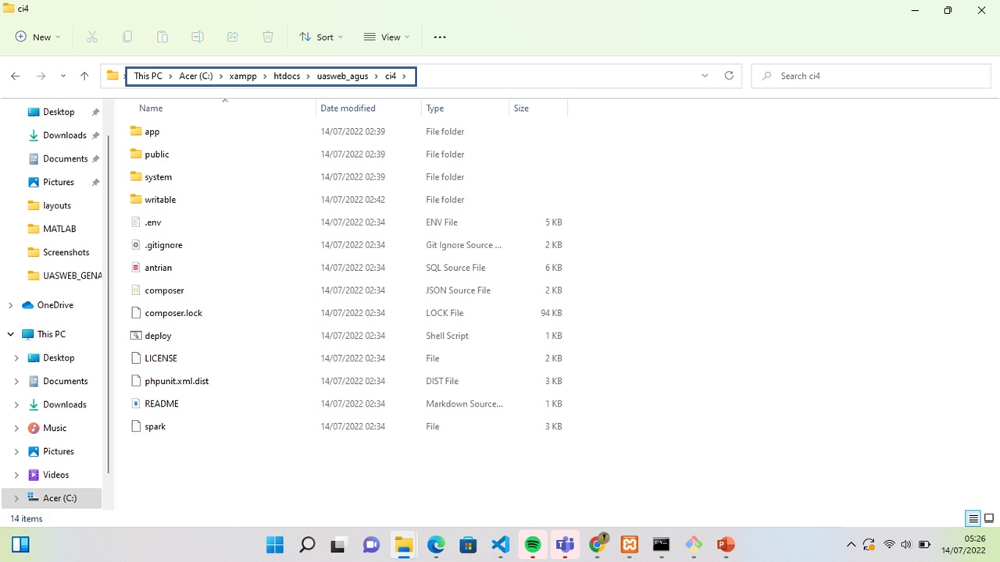
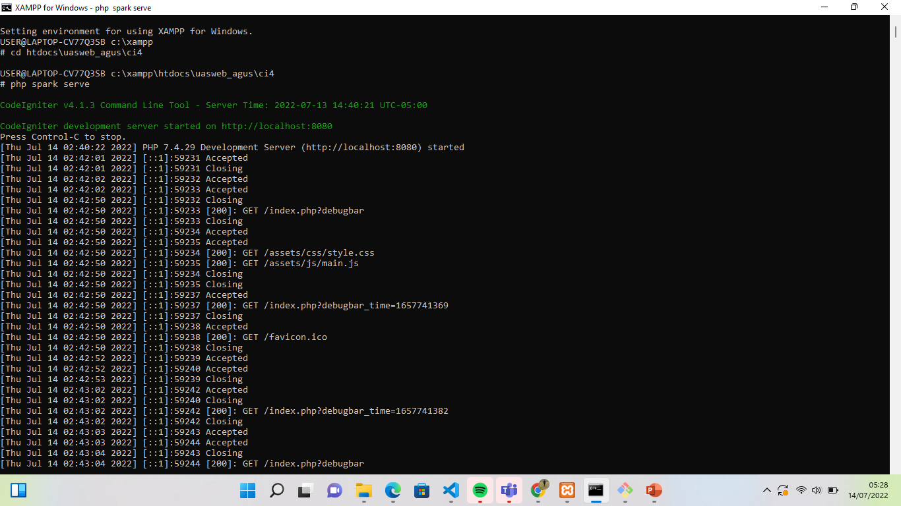

# UAS
## NAma    :Agus Salim NUrdin
## Kelas   :TI.20.B2
## Nim     :312010494

App Sistem Antrian Loket
Link

http://salimnurdin.my.id/


Getting Started
git clone https://github.com/agussalimnurdin/UASWEB_GENAP.git

open terminal.

php spark serve.
then,

Open http://localhost:8080
if an error

Constant FILTER_SANITIZE_STRING is deprecated
You are using PHP 8.1, and you need at least codeigniter 4.1.7

Solutions:

Option1: Downgrade PHP 7.4
Option2: Upgrade Codeigniter
Reference: https://codeigniter.com/user_guide/changelogs/v4.1.7.html
```shell
Constant FILTER_SANITIZE_STRING is deprecated
```

You are using PHP 8.1, and you need at least codeigniter 4.1.7

Solutions:

- Option1: Downgrade PHP 7.4
- Option2: Upgrade Codeigniter

Reference: https://codeigniter.com/user_guide/changelogs/v4.1.7.html


# langkah-langkah
## download xampp dan jalankan apache dan mysql



 ## kemudian membuat database di mysql nengan nama "antrian"

 

 ## kemudian buat program di ci4(codeigniter)

 

 ## kemudian ketik di xampp for windows seperti di bawah ini

 

 ## buka browser/googlecrome kemudian ketik localhost:8080

 

 THANK YOU SO MUCH