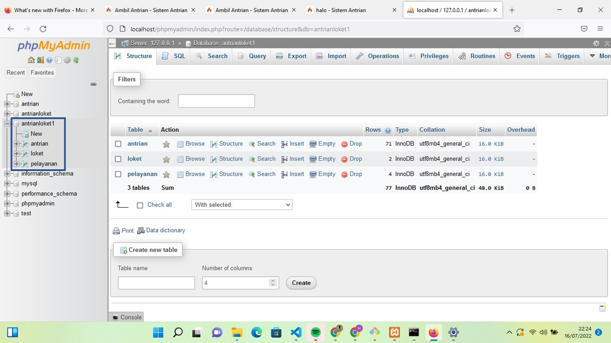
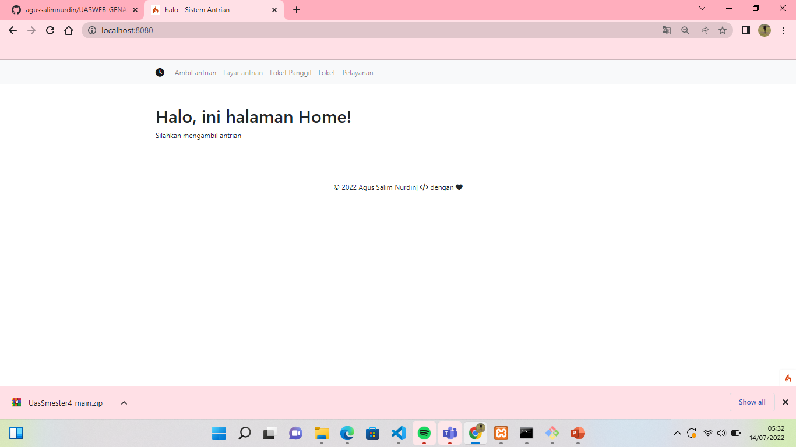
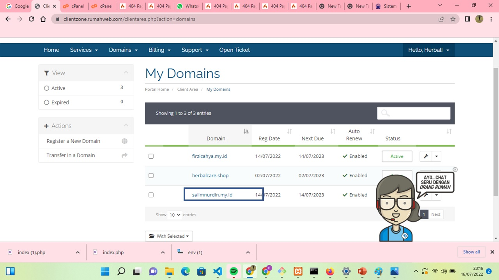

# UAS
## NAma    :Agus Salim NUrdin
## Kelas   :TI.20.B2
## Nim     :312010494

App Sistem Antrian Loket
Link untuk demo

http://salimnurdin.my.id/

link youtube : https://www.youtube.com/watch?v=N4a8-_CsKsE

Getting Started
git clone https://github.com/agussalimnurdin/UASWEB_GENAP.git

open terminal.

php spark serve.
then,

Open http://localhost:8080
if an error

Constant FILTER_SANITIZE_STRING is deprecated
You are using PHP 8.1, and you need at least codeigniter 4.1.7

Solutions:

Option1: Downgrade PHP 7.4
Option2: Upgrade Codeigniter
Reference: https://codeigniter.com/user_guide/changelogs/v4.1.7.html
```shell
Constant FILTER_SANITIZE_STRING is deprecated
```

You are using PHP 8.1, and you need at least codeigniter 4.1.7

Solutions:

- Option1: Downgrade PHP 7.4
- Option2: Upgrade Codeigniter

Reference: https://codeigniter.com/user_guide/changelogs/v4.1.7.html


# langkah-langkah
## download xampp dan jalankan apache dan mysql


 ## kemudian membuat database di mysql nengan nama "antrian"

 

 ## kemudian buat program di ci4(codeigniter)

 

 ## kemudian ketik di xampp for windows seperti di bawah ini

 

 ## buka browser/googlecrome kemudian ketik localhost:8080

 

 ## buat hosting. disini saya pakai rumahweb 

 

 ## kemudian buat domain

 

 ## klik  active


 ## kemudian login to cpanel

 


 ## masuk file manager


 ## kemudian buat folder baru


 ## dan masukkan file ci4 ke folder baru hasil file yg di pindahkan


 ## dan file public pindh ke public_html dan rubah nama menjadi salimnurdin.my.id
 ## buat nama database


 ## kemudian masuk phpmyadmin dan impor database 


 ## kemudian rubah nama yg dibawah ini

 


 ## ubah nama yang di block


## setelah itu masuk link 

http://salimnurdin.my.id/


## hasilnya seperti dibawah ini


## kemudian menu ambil antrian


## menu layar antrian


## kemudian menu loket panggil


## kemudian menu loket


## menu pelayanan 


# THANK YOU SO MUCH